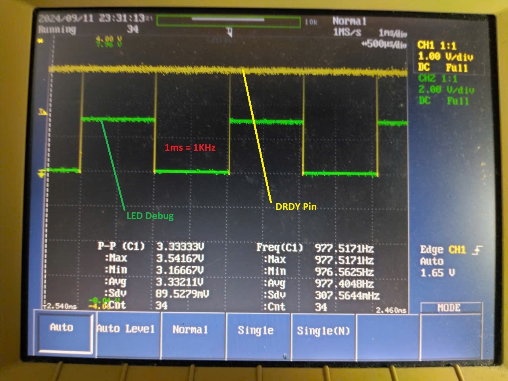
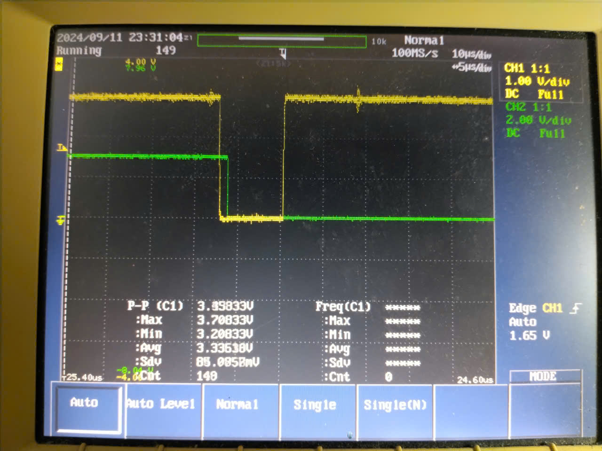
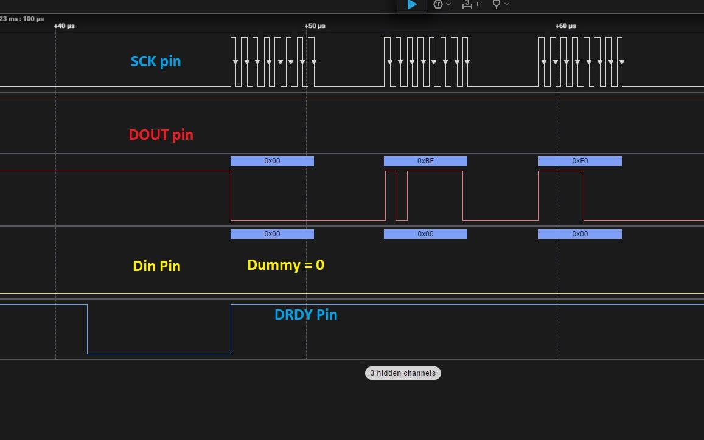
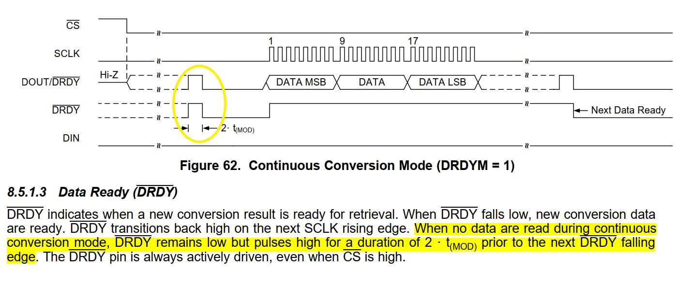
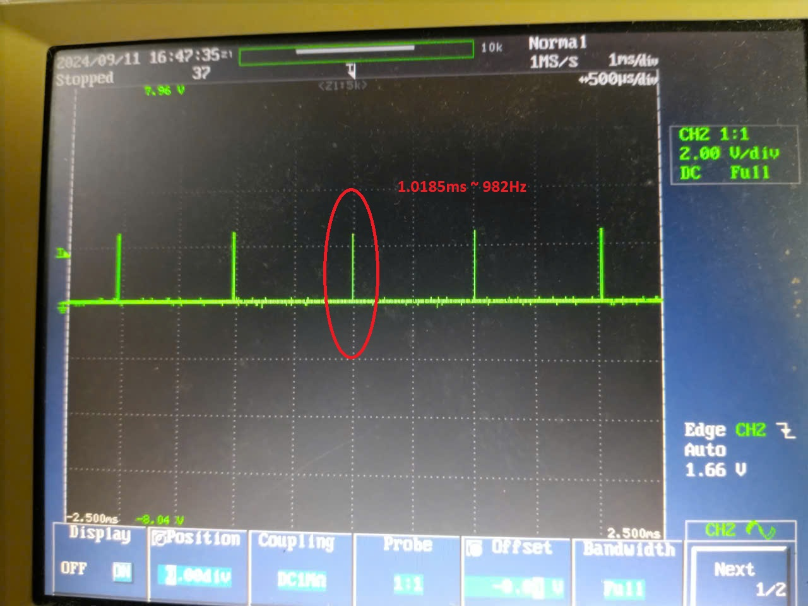
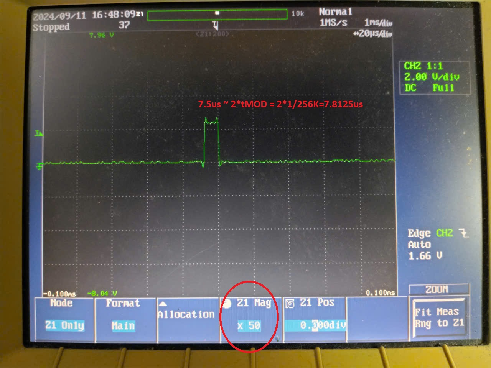

# ADS1220


## Read data with continuous mode using DRDY

```cpp
m_config_reg1 =
            (0b110<<5)|		// DR= 1000SPS
    		(0b00<<3)|		// Mode= Normal
			(0b1<<2)|		// Conv mode=continuous
			(0b0<<1)|		// Temp Sensor disabled
			(0b0<<0);		// Current Source off
 ```
```cpp
 extern void drdy_callback(){
	led_toggle();
	raw = ads1220_read_continuous();
}
 ```






## Note 



## Initialize the continuous mode and don't read the data of ADS1220




