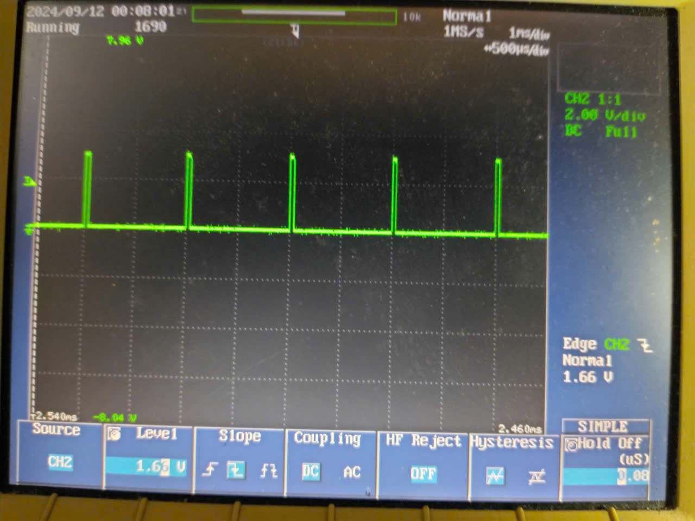

# ADS1220

# ADS1220 : Continuous DRDY

## Read data with continuous mode using DRDY

```cpp
m_config_reg1 =
            (0b110<<5)|		// DR= 1000SPS
    		(0b00<<3)|		// Mode= Normal
			(0b1<<2)|		// Conv mode=continuous
			(0b0<<1)|		// Temp Sensor disabled
			(0b0<<0);		// Current Source off
 ```
```cpp
i32 ads1220_read_continuous(){
	u08 rx[3] = {0};
	u08 tx[3] = {0};
	i32 result = 0;
	HAL_SPI_TransmitReceive(&hspi1, tx, rx, 3, 1000);
    result = rx[0];
    result = (result << 8) | rx[1];
    result = (result << 8) | rx[2];
    if (rx[0] & (1<<7)) {
        result |= 0xFF000000;
    }
    return result;
}

extern void drdy_callback(){
	led_toggle();
	raw = ads1220_read_continuous();
}
```


## Note 


## Initialize the continuous mode and don't read the data of ADS1220


# ADS1220 : RDATA
```cpp
i32 ads1220_read_rdata(){
	u08 rx[3] = {0};
	u08 tx[1] = {RDATA};
	i32 result = 0;
	HAL_SPI_Transmit(&hspi1, tx, 1, 1000);
	HAL_SPI_Receive(&hspi1, rx, 3, 1000);
    result = rx[0];
    result = (result << 8) | rx[1];
    result = (result << 8) | rx[2];
    if (rx[0] & (1<<7)) {
        result |= 0xFF000000;
    }
    return result;
}

extern void tim_callback(){
	led_on();
	raw = ads1220_read_rdata();
	led_off();
}
```




