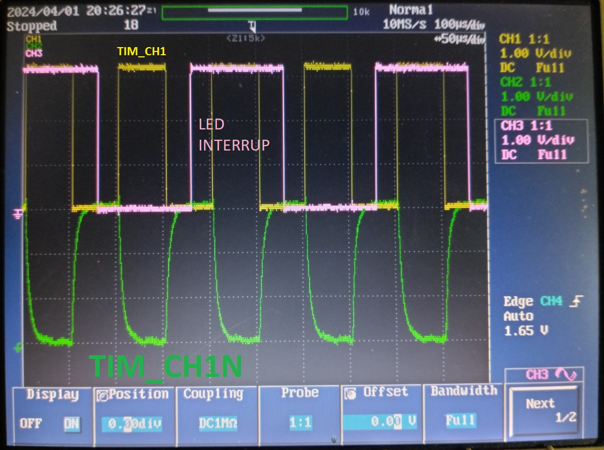

# 1. Timer Ossiloscope



# 2. Timer Init

```c++
	HAL_TIM_PWM_Start(&htim1, TIM_CHANNEL_1);
	HAL_TIMEx_PWMN_Start(&htim1, TIM_CHANNEL_1);
    HAL_TIM_Base_Start_IT(&htim1);
```

# 3. Timer Interrupt

```c++
    void HAL_TIM_PeriodElapsedCallback(TIM_HandleTypeDef *htim)
    {
    /* USER CODE BEGIN Callback 0 */
        if (htim->Instance == TIM1) {
            timer_call_back();
        }
    /* USER CODE END Callback 0 */
    if (htim->Instance == TIM17) {
        HAL_IncTick();
    }
    /* USER CODE BEGIN Callback 1 */

    /* USER CODE END Callback 1 */
    }
```
